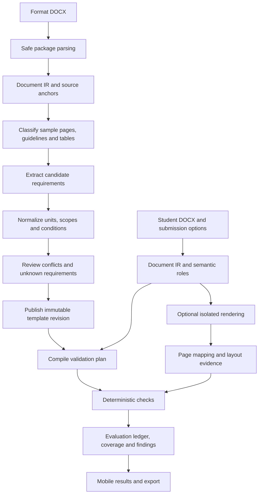

# ReportLint complex template implementation plan

Plan version: 1.0. Date: 2026-10-02. Status: proposed implementation specification, not implemented functionality.

Code baseline inspected: `83991c1` on `main`. Execution tracker: [COMPLEX_TEMPLATE_BACKLOG.md](COMPLEX_TEMPLATE_BACKLOG.md).

## 1. Objective and completion contract

Build a document compliance application that accepts a complex academic report-format DOCX, extracts its written requirements and structural examples into a reviewable specification, and checks a student's report against a published revision of that specification. The output must explain what failed, where it failed, what was expected, what was found, and which source requirement supports the finding.

The initial acceptance template is `Mini Project 1A Report_Format.docx`, supplied on 2026-10-02. It is a combination of sample pages, blank placeholders, a chapter index, synopsis guidance, and prose instructions. It is not a completed compliant report. Its actual Word formatting conflicts with some of its own written requirements. Therefore, copying its dominant font size, margins, page count, or paragraph positions cannot establish the intended format.

The target is reliable checking of a declared, measurable set of rules, with visible coverage. Do not claim that every arbitrary template can be completely understood automatically. Ambiguous instructions need review; unsupported digital checks need an explicit status; physical requirements need manual verification. A report with unknown or unimplemented mandatory checks cannot receive an unqualified compliant verdict.

### 1.1 User journeys

1. A teacher uploads a format document, sees extracted requirements with evidence and conflicts, resolves the conflicts, chooses allowed variants, and publishes an immutable template revision.
2. A student selects that revision, supplies any relevant options such as header usage or submission stage, uploads a report, and receives useful results without understanding Word XML or JSON.
3. The student opens an issue, sees its location and a concrete correction, edits the report in Word, and checks it again against the same revision.
4. A teacher can revise a template without changing the meaning of historical report checks.
5. A maintainer can reproduce a result using input hashes, rule revision, parser version, validator version, and rendering environment.

### 1.2 Release boundaries

| Release | Included | Completion boundary |
| --- | --- | --- |
| R1 | DOCX template understanding, reviewed rules, DOCX structural and property checks, evidence, coverage, mobile web and Android results | Correct interpretation and deterministic checking of the approved Mini Project profile, including deliberate-error fixtures |
| R2 | Rendering, verified page mapping, pagination, TOC page references, spatial caption checks and chapter opening layout | Page-dependent rules work in the pinned rendering environment, and uncertainty is exposed elsewhere |
| R3 | Generalization to additional academic templates and optional PDF input research | Evaluation on templates not used to tune extraction; a separately documented PDF capability matrix |
| Deployment gate | Authentication, ownership isolation, HTTPS, operational limits, retention controls | Required before hosting as a public multi-user service; distinct from a public source-code repository |

R1 may ship with a clearly labelled partial report where R2 rules remain unsupported. It may not describe the full complex template as fully checked. The target complex-template release is R1 plus R2, followed by the benchmark gate in section 15.

### 1.3 Explicit exclusions from the initial goal

- Plagiarism detection, factual assessment, automatic academic grading, and scientific-content quality are separate products or later features.
- Do not judge authenticity or fraud from visual differences.
- Do not automatically rewrite submitted reports in the initial implementation.
- Do not require cloud AI, OCR, a vector database, or a graph database for ordinary DOCX analysis.
- Do not claim offline checking on Android. The current native client continues to use the Python server.
- Paper whiteness, paper weight, printer type, binding colour, gold lettering, and physical signatures are manual checks.
- Scanned PDFs and handwritten reports are outside the initial acceptance gate.
- Initial guideline-language support is English. Preserve Unicode report content and script-specific formatting, but do not claim multilingual instruction extraction before it has its own benchmark.

## 2. Evidence and current limitations

### 2.1 Observed behavior on the supplied template

The following was measured with the baseline code, not inferred from the README:

| Observation | Current output | Required consequence |
| --- | --- | --- |
| Body size extraction | 11.5 pt, confidence 0.758 | Written instruction says 12 pt; show the conflict and propose the written requirement |
| Paper extraction | 612 by 792 pt, US Letter | Written instruction says 210 by 297 mm, A4 |
| Margin extraction | 72 pt on every side, 25.4 mm | Written instructions specify unequal margins and conditional top margin |
| Structure extraction | Seven front-matter headings | Main chapters inside the INDEX table are not extracted |
| Paragraph rule extraction | Zero rules | Indentation, paragraph spacing, and heading spacing are written requirements |
| Template self-check | 92.1 score, 0 errors, 199 warning occurrences | A self-check is not a valid correctness oracle for an instructional template |
| Document structure | 316 top-level paragraphs, 4 tables, 1 Word section | Table content and mixed document roles must be modeled |
| Styles | Only Normal and Default among top-level paragraphs | Semantic roles cannot depend solely on Word Heading styles |
| Field codes in main document | No TOC or PAGE fields found | Manual examples cannot be treated as working pagination or TOC demonstrations |

The last recorded existing suite run was 49 passing tests and four skipped optional pagination tests. That verifies the previous MVP, not the new requirements. New implementation must establish a new baseline rather than treating this count as evidence of complex-template correctness.

### 2.2 Code map and required evolution

| Existing module | Current responsibility | Planned change |
| --- | --- | --- |
| `app/ooxml/docx_loader.py` | Bounded ZIP/XML access; basic package parts | Add relationship-aware access to themes, headers, footers, notes and other supported parts; report unsupported structures |
| `app/ooxml/style_resolver.py` | Resolve some effective run/paragraph properties | Add property-level provenance, theme and toggle handling, numbering and table-style coverage; test each supported inheritance case |
| `app/ooxml/structure_extractor.py` | Flat paragraphs, table/image summaries, heuristic headings | Produce ordered nested blocks, semantic roles, section boundaries and numbering information |
| `app/models/document_model.py` | Flat document representation | Introduce versioned document IR with stable references and capabilities |
| `app/rules/rule_extractor.py` | Dominant appearance and body-heading extraction | Retain appearance sampling as one evidence source; add prose, table, scope and conflict extraction |
| `app/models/rule_model.py` | Broad rule enum and untyped expected dictionaries | Replace in v2 with validated rule-type payloads, conditions, evidence, review and support states |
| `app/compliance/validators/` | Typography, paragraphs, page properties and section checks | Add structure matching, fields, captions, numbering, front matter and later rendered checks |
| `app/compliance/engine.py` | Registry dispatch and violation aggregation | Explicit evaluation ledger and prerequisite handling; never silently skip an accepted rule |
| `app/compliance/scoring.py` | Category score from violation counts | Separate compliance, coverage, severity and unknown evaluations |
| `app/pagination/libreoffice_render.py` | Optional conversion and fuzzy paragraph-to-page matching | Isolated render worker, renderer fingerprint, spans/boxes, confidence and ambiguity handling |
| `app/storage.py` | Mutable JSON templates | Revisioned persistence and migrations, jobs and report artifact lifecycle |
| `app/api_routes.py`, `app/uploads.py` | Synchronous v1 template/check endpoints | Add `/api/v2` with jobs, revisions, review operations, capabilities and structured errors |
| `static/app.js`, `static/app.css` | Basic template review and check UI | Conflict review, coverage, progress and evidence views at mobile widths |
| `android/.../data`, `android/.../ui` | v1 client contracts and screens | v2 typed models, job polling/recovery, rule review and result parity |

Current `TableModel` stores counts and a caption string, not cell contents. Current body scope includes non-heading front matter. Current structure matching flattens names into a dictionary, which loses duplicate headings. The v2 design must fix these structural limitations rather than add special-case rules around them.

## 3. Research interpretation

The supplied papers are reference material, not authoritative requirements for this software.

| Reference | Useful idea | Boundary of transfer |
| --- | --- | --- |
| `Mad Lap Paper 1.pdf`, Auto Checker System | Modular academic formatting/structure checking with feedback | Its reported results belong to its own dataset. Grammar/plagiarism claims do not establish ReportLint performance or scope |
| `Mad Lab Paper 2.pdf`, medical template verification | Regions, OCR and visual evidence can assist image-based documents | Whole-page image similarity is not a reliable acceptance test for reports whose text, lengths and figures legitimately change |
| `Mad Lab Paper 3.pdf`, A Template-Based Approach for Industrial Title Block Compliance Check | User-reviewed semantic structure, acceptable variation, hierarchical entities and localized findings | Its experiment concerns industrial title blocks, not general academic reports. Adapt the concepts to a DOCX tree; do not copy its performance claims |

Paper 3, DOI `10.3390/a19020105`, is the strongest architectural reference for separating information extraction, compliance evaluation and explanation. Use its controlled-distortion benchmarking idea, but measure our own extraction and violation-detection performance independently.

## 4. Architectural decisions

| ID | Decision | Rationale and revisit condition |
| --- | --- | --- |
| ADR-01 | DOCX-first, deterministic property validation | Word contains richer formatting evidence than rasterized pages. Add PDF as another input adapter only after the DOCX contract is stable |
| ADR-02 | Written requirements and observed appearance are separate evidence channels | The acceptance template contains real contradictions |
| ADR-03 | Human review is required to resolve ambiguous or conflicting normative rules | Extraction confidence does not establish teacher intent |
| ADR-04 | Use an ordered document tree and indexes, not a graph database | Parent/child relationships, sequence and references fit in-memory objects and persisted JSON |
| ADR-05 | Introduce strict v2 models alongside v1 compatibility | Existing web/Android clients must not silently misinterpret new states |
| ADR-06 | Use SQLite for revisions, jobs and metadata; a filesystem artifact store for large binaries | Suitable for the trusted single-server deployment, with transactional updates and minimal installation burden |
| ADR-07 | Keep validation and rendering as separate stages | Most properties are measurable without rendering; render failure must not erase valid structural findings |
| ADR-08 | A published template revision is immutable | Every check must refer to an exact, reproducible specification |
| ADR-09 | Status and coverage precede a percentage score | A high score with untested mandatory rules must not look like full compliance |
| ADR-10 | Optional model-assisted extraction creates candidates only | No model output may execute code or become a published rule without schema validation and review |
| ADR-11 | Preserve current mobile client and Python backend architecture | The immediate problem is analysis correctness; replacing the app stack is not required |
| ADR-12 | No automatic external document transfer | Any future cloud extraction adapter requires explicit configuration and clear data-flow disclosure |

New dependencies must have a documented purpose, supported platform behavior, version constraints, and distribution/licensing review before adoption. Do not add dependencies merely because a research paper used them.

## 5. End-to-end pipelines



Every stage records its version, input/output hashes where useful, duration, warnings and capabilities. Stages return typed results, not loosely structured dictionaries. Parsing succeeds only when a usable representation exists; partial feature support is reported separately from corrupted input.

Recommended new module boundaries:

```text
app/
  models/v2/                 document, evidence, rule, template, job, result contracts
  ooxml/                    package, relationships, styles, numbering, fields, blocks
  analysis/                 roles, front_matter, chapters, tables, captions, indexes
  rules/                    prose, table_requirements, appearance, normalize, conflicts, compile
  compliance/validators/    existing plus structural, fields, numbering, captions, rendered
  pagination/               worker, renderer, layout_model, alignment, environment
  services/                 template_review, publishing, report_check, export, retention
  persistence/              repositories, sqlite schema, migration, artifact_store
  jobs/                     queue, leases, execution, cancellation, recovery
  api/v2/                   templates, revisions, jobs, checks, capabilities, artifacts
```

These are responsibility boundaries, not a requirement to create empty files immediately. Introduce modules when a milestone supplies their first behavior.

## 6. Document intermediate representation

### 6.1 Identity and location

- `document_id`: opaque job-local identifier; `source_sha256`: exact original bytes; `schema_version`: 2.
- `node_id`: stable for the same source bytes and parser version, derived from package part and deterministic structural path, not from visible text alone.
- `SourceAnchor`: part URI, node ID, block path, optional run/character range and text excerpt. Preserve zero-based internal indexes; display one-based human labels.
- Keep node identity distinct from render location. Editing a report may change node IDs; cross-run comparison needs a separate alignment layer.
- Paragraphs spanning pages have several page spans, not one guessed page integer.
- Track physical PDF page index separately from printed page label such as `iv`, `1`, or suppressed label.

### 6.2 Ordered block tree

Represent document stories and their ordered contents:

- Main body: paragraphs, tables, section breaks and supported drawing/text-box nodes.
- Table: rows, cells, grid spans, vertical merges, nested tables and paragraphs within cells.
- Header/footer: default, first-page and even-page variants, links to previous sections and referenced fields.
- Footnotes/endnotes where supported; bibliography and text boxes must have declared support status.
- Text: runs, tabs, explicit line/page breaks, hyperlinks, field instructions/results, content controls, bookmarks and tracked-change markers.
- Images: relationship target, inline/anchored placement, extent, surrounding anchors, alternative text and decorative/content role candidates.

Keep an ordered flattened view as an index, not as the sole representation. Never count the same paragraph twice because it appears through both a tree traversal and an auxiliary list.

Declare support for Transitional versus Strict OOXML namespaces, equations, alternate-content branches, comments, complex text boxes and multi-column layouts. Test supported forms and report unsupported forms when they can affect a rule; successful ZIP opening is not evidence of complete document understanding.

### 6.3 Effective formatting

Each property stores `value`, `unit`, `origin` and `resolution_status`. Origins include direct formatting, character style, paragraph style, based-on chain, applicable table style, document default, theme and unresolved.

Required properties include font by script, size, bold/italic/caps, alignment, line-spacing mode/value, before/after spacing, contextual spacing, indents, tabs, keep-with-next, keep-lines, widow control, outline level and page-break-before. Section properties include page size/orientation, margins, gutter, mirrored margins, columns, header/footer distance and page-number settings.

Do not implement all OOXML inheritance as a naive single precedence list. Character/paragraph/table styles and toggle properties have different semantics. Use focused fixtures for each supported case and return unresolved for an unsupported interaction. Resolve `0`, `false`, and absent independently.

Read theme fonts and script-specific font slots rather than assuming every `w:rFonts` name is the displayed font. A fallback rendering font may differ from the requested Word font; expose that separately.

### 6.4 Section and numbering semantics

- A paragraph-level `sectPr` terminates the preceding Word section; the final body `sectPr` describes the last section. Compute ranges accordingly.
- Parse `numId`, `abstractNumId`, `ilvl`, numbering format, start/restart overrides, level text and suffix to recover displayed heading/list numbering.
- Store heading level and numbering separately from its text and style name.
- Preserve field instructions such as PAGE, NUMPAGES, TOC, SEQ and REF and their cached results. Cached values may be stale.
- If tracked changes exist, report the policy used. Initial policy: validate the final-view interpretation only where supported; otherwise require an accepted/rejected-changes copy for affected checks.

### 6.5 Semantic roles and confidence

Supported role candidates: cover title, author field, institution field, certificate, declaration, abstract, contents entry, list-of-figures entry, list-of-tables entry, abbreviations, chapter heading, section heading, body paragraph, figure caption, table caption, reference entry, acknowledgement, template guideline and placeholder.

Store several candidate roles with evidence when ambiguous. Do not infer a heading exclusively from boldness or capital letters. Combine style/outline evidence, numbering, relative font size, location, neighboring blocks and document context. Do not let a table-of-contents entry satisfy the presence of the corresponding chapter.

## 7. Template understanding and rule extraction

### 7.1 Classify source regions first

1. Detect guideline regions using headings and instructional language, while retaining their original positions.
2. Identify front-matter examples, placeholders and sample tables.
3. Identify index/contents tables by their headers, numbered rows and topic cells.
4. Identify synopsis guidance separately from the full report index. These may describe different submission artifacts.
5. Mark ordinary example prose separately from normative instructions.
6. Produce a reviewable region map. Uncertain boundaries stay uncertain; do not simply classify everything after a keyword as instructions forever.

For the supplied template, the chapter list is in table 0 and synopsis guidance is in table 3. They must not be merged into one mandatory chapter order without a review decision.

### 7.2 Candidate extraction channels

**Explicit prose:** implement patterns for font names/sizes, paper dimensions, margins, alignment, spacing, indentation, page numbering, caption placement, required fields, ordering, word counts and conditional phrases. Recognize `shall`, `must`, `should`, `may`, `if`, `when`, `normally`, `about`, alternatives and exclusions. Preserve modality instead of turning all statements into errors.

**Tables:** read cells and their paragraph boundaries; use row/column relationships to distinguish chapter numbers, titles, descriptions and page placeholders. Split multiline topic lists into parent and child candidates where justified. A slash can mean an alternative title, a combined topic, or prose punctuation; do not globally interpret it as an alias separator.

**Appearance:** sample effective formatting within a classified role, not across the entire file. Weight observations consistently and report sample sizes. A dominant appearance is evidence of a possible rule, not proof of normative intent.

**Optional model-assisted extraction:** add an adapter only after deterministic extraction exposes its remaining gaps. Send bounded source spans to a configured model and require candidate JSON with source spans. Validate every value and source anchor, and display candidates for review. Document content is untrusted data; it cannot instruct the system to run tools, fetch URLs or change application policy. Keep evaluation possible without this adapter.

### 7.3 Units and interpretation

- Canonical internal linear unit: points, using `72 / 25.4` points per millimetre. Preserve original values and units for explanation.
- Keep line-spacing multiples separate from exact and minimum point spacing.
- Keep a physical length separate from a font-size instruction even when both mention millimetres.
- Round only at display boundaries. Rule comparison uses explicit tolerances.
- `About 75 mm additional top margin` is not an unambiguous instruction to set section top margin to 75 mm. Store the original statement and resolve its intended measurement before enforcing it.
- `2.5 line spacing between paragraphs` is not automatically a body line-spacing multiplier of 2.5; confirm whether it means a vertical gap and how that gap is measured.
- `500 word abstract` requires a decision about exact count, maximum, or approximate target and a defined word-count convention.

### 7.4 Conflict handling

Candidate preference for review is: explicit reviewer decision, explicit scoped prose, consistent role-specific examples, and finally statistical appearance. This ordering proposes a resolution; it does not silently suppress a conflict.

A conflict contains candidate IDs, their source spans, scopes, normalized values, conflict type, suggested resolution and review state. Conflict types include appearance/prose disagreement, competing prose instructions, unit ambiguity, incompatible scopes, missing condition, and alternative document profiles.

For this template, at minimum flag paper size, body size, margins, report-versus-synopsis structure, front-matter pagination scope, optional header behavior, paragraph indentation alternative and chapter-opening spacing. Publication must be blocked until mandatory contradictory candidates are resolved or explicitly deferred with an explanation.

### 7.5 Requirement coverage ledger

Every identified normative source span must map to one or more candidate rules or to an explicit disposition: duplicate, advisory, manual-only, ambiguous, unsupported, or out-of-scope with a reviewer reason. Do not discard a difficult paragraph because no parser pattern matched it. Expose unclassified instructional spans in review.

This ledger is separate from report-check coverage. It answers: how much of the template's instructions have been accounted for? Report-check coverage answers: how much of the published specification was actually evaluated on this report?

## 8. Rule schema and template lifecycle

### 8.1 Rule envelope

Use Pydantic discriminated unions keyed by `kind`; generate OpenAPI/JSON Schema from the same models. Reject unsupported payload fields with `extra='forbid'` for authored rules. Version the schema independently from the template revision.

| Field | Meaning |
| --- | --- |
| `rule_id` | Stable identity across revisions for the same logical requirement |
| `kind`, `schema_version` | Validator contract and payload version |
| `scope` | Semantic role, section/profile filter, inclusion/exclusion predicates |
| `assertion` | Typed expected value or structural relation |
| `applicability` | Typed conditional expression over report/profile facts |
| `prerequisites` | Required entities/capabilities and dependency behavior |
| `obligation` | REQUIRED or RECOMMENDED; optional presence is expressed by applicability/cardinality, not by silently disabling checks |
| `severity` | Error, warning or advisory; independent from extraction confidence |
| `weight` | Positive bounded scoring weight; default 1, reviewer-editable only through supported controls |
| `tolerance` | Typed numeric/positional tolerance with units and rationale |
| `evidence` | Source anchors, excerpts, observed values and extraction method |
| `review` | Proposed, confirmed, rejected or deferred; reviewer decision and timestamp |
| `verification_mode` | Property, structure, rendered, manual or semantic advisory |
| `support` | Supported, partial or unsupported by engine capability/version |
| `message_key` | Stable user-facing message template, not arbitrary executable formatting |

Initial assertion families: property equals/range, required entity, cardinality, ordered sequence, parent-child membership, numbering sequence, caption relationship, field presence/value constraint, word-count bound, rendered position, page-label sequence, TOC/reference consistency and manual checklist item.

### 8.2 Example confirmed body rule

```json
{
  "schema_version": 2,
  "rule_id": "BODY-FONT-SIZE",
  "kind": "font_size",
  "scope": {"roles": ["body_paragraph"], "story": "main"},
  "assertion": {"expected_pt": 12.0},
  "tolerance": {"absolute_pt": 0.25},
  "applicability": {"op": "always"},
  "prerequisites": ["effective_run_font_size"],
  "obligation": "REQUIRED",
  "severity": "ERROR",
  "weight": 1.0,
  "verification_mode": "PROPERTY",
  "support": "SUPPORTED",
  "evidence": [{"source_id": "format-source", "anchor": "guideline-body-format", "method": "EXPLICIT_PROSE"}],
  "review": {"status": "CONFIRMED", "decision": "Use the explicit 12 pt requirement instead of the observed 11.5 pt sample"},
  "message_key": "font_size_mismatch"
}
```

This illustrates the intended contract; implementation must define the full JSON Schema and timestamps/identity fields. Source anchors in persisted rules must resolve to real retained source evidence, not informal names as in this example.

### 8.3 Conditions and exceptions

Use a restricted expression tree: `all`, `any`, `not`, `equals`, `exists`, `in`, and numeric comparisons over approved facts. Never evaluate Python, JavaScript, SQL or arbitrary expression strings from templates.

Conditions evaluate TRUE, FALSE or UNKNOWN. FALSE yields NOT_APPLICABLE. UNKNOWN yields UNKNOWN with a reason; it must not choose the easier branch. Facts may come from document evidence or explicit submission options, and their provenance must be visible.

Examples: header enabled, dedication included, figure count greater than zero, hard-bound final submission, first page of main matter, odd/even page, and heading level. A missing mandatory chapter fails its presence rule; typography rules inside that chapter are blocked by the missing prerequisite rather than generating hundreds of phantom failures or vacuous passes.

More-specific approved scope overrides a general scope only when the relationship is explicit in the compiled plan. Different rules that accidentally assert incompatible values on the same target are compilation conflicts.

### 8.4 Lifecycle and publication

Source upload -> extraction job -> draft revision -> review -> compilation -> publication. Editing a published revision creates a new draft. Reports always pin a published revision ID/hash. A preview check may target a draft but is labelled provisional.

Publication checks: valid schema; all evidence references resolvable; no unresolved hard conflicts; no invalid dependency cycles; unique rule identities; complete disposition of mandatory candidates; supported conditions; visible manual/unsupported requirements; explicit profile choice; valid tolerance and severity values.

Unsupported requirements may remain in a published revision if expressly acknowledged and disclosed. They are not silently removed and must prevent an unqualified full-compliance verdict when applicable. A separate `automated_rules_only` claim must never be presented as complete-template compliance.

## 9. Mini Project rule catalog

This is the seed inventory for review, not a pre-approved universal ruleset. Paragraph numbers below are zero-based indexes from `python-docx` top-level paragraphs in the exact source hash listed in section 20; they are evidence anchors for inspection, not rendered page numbers. `T0` and `T3` refer to the index and synopsis tables. Exact enforcement, applicability and tolerances are finalized in the reviewed profile.

Modes: P = OOXML/property; S = structural; R = rendered; M = manual; A = advisory/semantic. Phases are implementation milestones from section 16.

| ID | Requirement candidate | Source | Mode / phase | Interpretation or dependency |
| --- | --- | --- | --- | --- |
| MP-01 | A4 portrait, 210 by 297 mm | P229 | P / M4 | Conflicts with actual Letter section; explicit orientation exceptions need review |
| MP-02 | Times New Roman body | P231 | P / M4 | Scope excludes cover, captions and other separately specified roles |
| MP-03 | Body 12 pt | P231 | P / M4 | Conflicts with observed 11.5 pt; preserve as a review example |
| MP-04 | Body 1.5 line spacing | P231 | P / M4 | Check multiple spacing, not exact 18 pt equivalence |
| MP-05 | Left 30 mm, right 20 mm, bottom 22 mm | P237,240,241 | P / M4 | Section scope and permitted landscape pages require policy |
| MP-06 | Top 15 mm when header used, 30 mm without header | P234,244 | P+R / M4,M6 | Decide meaning of written top margin versus Word header/text geometry |
| MP-07 | Header height 3 mm and separation 12 mm | P235,236 | R / M6 | Word header distance is not equivalent to header height; define geometry |
| MP-08 | Footer 3 mm and separation 10 mm | P238,239 | R / M6 | Ambiguous physical measurements need an approved interpretation |
| MP-09 | Text area 245 by 160 mm | P242,243 | P+R / M6 | Reconcile with margins and header/footer measurements before enforcement |
| MP-10 | Lowercase Roman numbering in auxiliary pages | P246,312 | P+R / M6 | Conflicting starting scopes require a selected front-matter policy |
| MP-11 | Arabic main-matter numbering beginning with Introduction | P246,312 | P+R / M6 | Detect logical section start and displayed label |
| MP-12 | Suppress visible page 1; next main page displays 2 | P246 | P+R / M6 | Presence of first-page settings alone is insufficient proof |
| MP-13 | Page numbers centered in footer | P246,298 | P+R / M6 | Match field or visible number region, not any numeral on page |
| MP-14 | Subsequent chapters begin on a new page | P246,253 | S+R / M4,M6 | Page-break-before, explicit break and natural pagination are alternative mechanisms |
| MP-15 | Optional odd/even chapter or section headers | P248 | P+R / M6 | `Can have` means optional, with content rules if selected |
| MP-16 | Paragraph separation about 2.5 lines | P250 | P+R / M4,M6 | Define gap, baseline and tolerance; do not change body line spacing |
| MP-17 | First-line indent 12 mm, or sufficient paragraph separation | P250 | P / M4 | Preserve OR condition; define sufficient separation in review |
| MP-18 | No orphan/widow single line at page top/bottom | P250 | R / M6 | Setting `widowControl` is supporting evidence, not visual proof |
| MP-19 | Avoid end-of-first-line hyphenation where possible | P250 | R+A / M6 | Advisory wording and language-dependent interpretation |
| MP-20 | Chapter opening offset about 75 mm additional top margin | P253 | R / M6 | Unresolved absolute-versus-additional measurement |
| MP-21 | Chapter number and title 18 pt, bold, centered, mixed case | P253 | P+S / M4 | Title may occupy separate paragraphs; handle acronym exceptions |
| MP-22 | Approximately 12 mm gaps around chapter-title lines | P253 | P+R / M4,M6 | Source also describes 36 pt spacing; normalize and review equivalence |
| MP-23 | Decimal section/subsection numbering aligned to parent chapter | P255 | S / M5 | Recover generated Word numbers as well as typed numbers |
| MP-24 | Section headings 16 pt bold, left aligned | P256 | P / M4 | Map semantic level independently of arbitrary style names |
| MP-25 | Subsection headings 14 pt bold, left aligned | P256 | P / M4 | Distinguish subsection from sub-subsection |
| MP-26 | 15 mm spacing before and after section/subsection headings | P256 | P+R / M4,M6 | Collapsing Word spacing and rendered gap may differ |
| MP-27 | Further subdivisions may use alternate fonts/case/alignment and stay out of contents | P257 | P+S / M5 | Optional variants; do not invent a single mandatory size |
| MP-28 | Figures and tables numbered by chapter | P259 | S / M5 | Support Figure/Fig aliases, sequences and resets |
| MP-29 | Table captions above tables | P260 | S+R / M5,M6 | Link caption to a specific table; handle intervening anchors and split tables |
| MP-30 | Figure captions below figures | P260 | S+R / M5,M6 | Exclude decorative logo; handle floating figures |
| MP-31 | Citation line for reproduced figures/tables | P260 | S+A / M5 | Only when reproduction status is known; provenance cannot be inferred reliably |
| MP-32 | Prefer portrait; placement depends on figure/table size | P259 | R+A / M6 | Advisory preference and ambiguous area threshold need review |
| MP-33 | Cover title centered, 22 pt, near top | P282 | P+R / M4,M6 | Distinguish cover title from chapter title; region tolerance required |
| MP-34 | Candidate names centered, 15 pt, near middle | P283 | P+R / M4,M6 | Variable names and number of members; no literal placeholder matching |
| MP-35 | 50 mm institute emblem plus institution/year block | P284 | P+R / M4,M6 | Presence/size possible; authentic emblem identity needs an approved asset or manual check |
| MP-36 | Title sheet contains title, submission statement, names, roll numbers, guides, institute and year | P292 and cover example | S / M4 | Variable fields, cardinality and consistency across pages |
| MP-37 | Dedication is optional; alters auxiliary pagination | P295,296 | S+R / M4,M6 | Do not require absence or presence automatically |
| MP-38 | Approval sheet conditional on final hard-bound submission | P297-302 | S / M4 | Keep certificate sample and approval requirement distinct until reviewer decides |
| MP-39 | Abstract has a 500-word requirement | P305,306 | S / M4 | Exact/maximum/target ambiguity; define count conventions |
| MP-40 | Abstract includes chapter overview and keywords | P306 | S+A / M4 | Presence cues are checkable; quality of summary is advisory |
| MP-41 | Contents follows abstract and includes chapters/sections/subsections | P255,308 | S / M5 | Ignore source guideline numbering; compare against actual report hierarchy |
| MP-42 | Contents page numbers match report and align right | P308 | S+R / M5,M6 | Do not trust stale cached TOC fields |
| MP-43 | Separate figure/table lists with captions, numbers and pages | P309 | S+R / M5,M6 | Decide whether lists are required when there are zero objects |
| MP-44 | Abbreviations list follows lists of figures/tables | P310,311 | S / M4 | Presence/order check; completeness may need human review |
| MP-45 | Declaration of academic honesty after approval | P313,314 | S / M4 | Check required content/fields, not truth of declaration |
| MP-46 | Main report chapters from index: Introduction, Literature Survey and Analysis, System Design, Conclusion and Future Scope | T0 | S / M4 | Parent-child topics and title aliases need review |
| MP-47 | References and acknowledgements included in intended positions | T0 and example | S / M4 | Resolve example/order variation; spelling variants allowed |
| MP-48 | Synopsis has a different sequence including Scope and Proposed System | T3 | S / M3,M4 | Separate profile; never require both structures simultaneously by default |
| MP-49 | Student/guide/project placeholders replaced consistently | Cover/certificate/declaration samples | S / M4 | High-specificity placeholders only; ordinary words must not trigger false positives |
| MP-50 | Paper whiteness/weight, printing side/type, black binding, gold lettering and physical blank sheets | P229,231,278-290 | M / M3 | Inventory and disclose; digitally blank pages do not prove physical binding sheets |

All 50 IDs must receive an implementation or explicit disposition. Splitting one row into several executable rules is allowed; keep the parent MP ID in their traceability metadata. Changing an interpretation must update its decision record and fixtures.

## 10. Validation algorithms and invariants

### 10.1 Compile before evaluating

Compile a published revision into a validation plan: verify payload types, normalize units, resolve scopes and aliases, validate conditional facts, build a prerequisite DAG and attach required engine capabilities. Reject cycles and conflicting assertions. Cache by revision content hash and compiler version. The compiled representation is derived data and can always be rebuilt.

Validators are pure functions over a document analysis context, a typed rule and resolved targets. They return evaluation items and findings without changing the document, template or database. Shared indexes should be built once per job: nodes by role/style, heading hierarchy, table/figure associations, numbering, fields, text search and page spans.

### 10.2 Semantic scope resolution

- BODY means body content under main report chapters, with explicit exclusions for front matter, contents entries, captions, tables, quotations and other reviewed exceptions. It does not mean every non-heading paragraph.
- Required scope resolution with no target is not a pass. Determine whether a presence prerequisite failed, the role mapping is unknown, or the scope is genuinely not applicable.
- Chapter title can be a number paragraph followed by a title paragraph. Treat the pair as one semantic entity while keeping two source anchors.
- A paragraph in a table can have a body-like style without becoming ordinary body text.
- Keep appendix scope separate where numbering and headings legitimately differ.
- In an uncertain role assignment, evaluate properties only if the outcome is valid for every plausible applicable role; otherwise return UNKNOWN with the ambiguity.

### 10.3 Chapter and section matching

1. Build the actual heading tree from styles, outline levels, numbering, positional context and conservative visual cues.
2. Normalize whitespace/case and numbering prefixes while retaining original text and level.
3. Generate candidate matches using exact canonical name, approved aliases and then fuzzy text similarity. Similarity alone does not establish a match.
4. Apply parent, level, profile, sequence and role constraints. Use a one-to-one assignment for sibling required entities with declared cardinality; do not reuse one actual heading to satisfy two mandatory chapters.
5. Preserve repeated headings under different parents, such as a Conclusion inside multiple chapters. Do not key the entire document solely by normalized text.
6. If candidates remain similarly plausible, report ambiguity rather than selecting the first match.
7. Evaluate presence, optionality, cardinality, parent membership and order independently. Optional absence does not fail; optional presence still receives its applicable formatting checks.

Implement exact/alias matching first. Add fuzzy matching only with labeled ambiguity fixtures and configurable, benchmarked thresholds. Initial thresholds are provisional configuration, not statements of confidence probability.

A combined title such as Conclusion and Future Scope can satisfy an approved combined entity, but it must not automatically satisfy any two separate requirements without a declared equivalence. Likewise, a TOC row mentioning System Design is not evidence that the chapter exists.

### 10.4 Typography and paragraph properties

- Evaluate all non-empty applicable text runs, including short paragraphs and mixed-format runs; do not compare only the first run.
- Preserve ignored-character policies for whitespace, symbols, mathematical notation and script-specific font exceptions.
- Aggregate adjacent failing runs for presentation while retaining their individual target references.
- Distinguish exactly spaced, minimum spaced and multiple spaced paragraphs. Include supported contextual-spacing behavior.
- Evaluate direct style properties and inherited effective values consistently. A Word style name such as Normal is not itself a font requirement.
- Missing font/theme evidence produces UNKNOWN, not an assumed default or an automatic failure.
- Separate configured paragraph spacing from rendered vertical gap. Either may be the intended metric depending on the approved rule.
- Do not report both a body font rule and a heading font rule against the same text unless the reviewed scope intentionally overlaps.

### 10.5 Tables, figures and captions

Build associations using object position in the ordered tree, neighboring caption candidates, caption numbering, chapter context and explicit SEQ/REF fields. Bound the search region to avoid attaching an unrelated caption from another chapter. Exclude contents/list entries from caption candidates.

For tables, preserve merged cells, nested structures, repeated header rows and row ordering. A table continued onto another page remains one table entity. For figures, distinguish inline and anchored objects; paragraph order is not sufficient to prove the visible position of a floating image.

Check presence, numbering pattern, sequence/restart, duplicates and above/below relation. When R2 is available, use rendered boxes for placement. If two objects and two captions cannot be paired uniquely, return UNKNOWN for the relationship rather than blaming one arbitrarily.

Decorative logos do not require ordinary figure captions unless the specification says so. Reproduction/source attribution is checked only when its applicability is supplied or supported by reliable evidence; the software cannot establish originality from the file alone.

### 10.6 Contents, lists and cross-references

Support both real TOC fields and manually authored tables/paragraphs. Extract entry title, level, number, printed page label and hyperlink/bookmark target where available. Compare against actual headings and objects; flag missing entries, extra entries, mismatched titles/numbers and wrong order separately.

Rendered page consistency is an R2 check. Preserve distinctions between physical page 8, printed label `iv` and an intentionally suppressed label. A matching cached TOC field result does not prove it is current. If rendering updates fields, record that policy and report whether the original submitted view was stale. Do not silently update and then declare the original valid.

References to figures/tables may use typed text or REF fields. Limit automatic cross-reference validation to recognized patterns and fields. Full bibliographic style validation is not included until a specific citation style is selected and testable.

### 10.7 Front matter and variable fields

Recognize required labels and roles while permitting students to change project titles, names, roll numbers, guide names, year and body text. Match required fixed institutional wording only where a reviewed rule explicitly requires it.

Placeholder detection starts with high-specificity phrases from the template, such as NAME OF THE PROJECT or Member 1 (Roll No.). Do not flag ordinary uses of `name`, `title` or `student`. Check consistent normalized project title and member identity across cover/certificate/declaration only when the fields can be extracted confidently. Do not infer that a digital signature image proves a valid signature.

Define the abstract word counter: selected abstract body nodes only; exclude heading and keyword label; document how punctuation, hyphenated terms, numbers, tables and references count. Support exact/range/maximum rules but leave this source's interpretation unresolved until reviewed.

### 10.8 Independent findings and presentation grouping

Every evaluation target has a deterministic key `(revision_id, rule_id, node_or_relation_id, property_or_assertion)`. Repeated traversal must not duplicate outcomes. Every FAIL has at least one source anchor and expected/actual evidence, or a document-level explanation for a missing entity.

Group repeated findings only for presentation. Expanding a group must reveal all affected locations; grouping cannot change the number of checks, failures, coverage or score. A report may have one group for an incorrect body font but 20 affected paragraphs.

## 11. Rendering and page-aware analysis

### 11.1 Rendering contract

Use a pinned LibreOffice runtime for the first server rendering implementation, with a documented font set and a per-job user profile. Preserve the uploaded DOCX unchanged and render a job-local copy. Execute with argument lists, bounded resources, timeout and no user-controlled command fragments. The worker must not open external relationships or download linked content.

Record renderer product/version, OS image identifier, font manifest/hash, locale, conversion options, field-update policy, input hash and output hash. A rendering error returns a stage error and disables dependent checks; it does not turn those checks into PASS.

LibreOffice and Word can paginate differently. Exact layout findings must identify the rendering basis. Where the institution considers Word's output authoritative, collect reference PDFs from that environment and quantify differences before enabling strict page geometry rules. The developer's machine must not be the only reference environment.

### 11.2 Page mapping algorithm

The existing fuzzy leading-snippet matcher is a prototype, not sufficient for exact page claims. Replace or augment it with:

1. PDF extraction of text spans, bounding boxes, page dimensions and reading-order candidates.
2. Normalization that handles ligatures, soft hyphens, whitespace and generated numbering while retaining original text offsets.
3. Candidate matching for paragraphs/runs, with neighboring-block context and chapter anchors.
4. Monotonic alignment for ordinary main-story blocks, with separate handling for headers, footers, tables, footnotes and floating elements.
5. Support for one source node mapped to several page spans and several text spans mapped to one node.
6. Ambiguity detection for repeated names, repeated headings, empty paragraphs and short captions.
7. A confidence threshold calibrated on hand-labeled mappings, plus a runner-up margin; ambiguous mappings remain null.

Bounding boxes use an explicit coordinate system, page rotation and units. Preview coordinates must transform correctly to CSS/device pixels. Never annotate page 1 simply because a match could not be found.

### 11.3 Layout checks

Use reliable page mappings and bounding boxes for chapter opening position, start-on-new-page, caption position, right-aligned TOC labels, printed page sequences and widow/orphan evidence. Check that page labels in the footer are not confused with chapter numbers or footer text.

For indentation and margins, distinguish configured page/paragraph properties from visible text boundaries. A shorter paragraph does not prove a larger right margin. Heading spacing may collapse across adjacent paragraphs. Do not infer an exact line-spacing multiplier from a single pair of rendered baselines without supporting evidence.

Implement a capability gate per rendered check. A mapped text block alone does not imply accurate line segmentation, image bounding boxes or field identification. Missing fonts and unexpected substitutions must be visible and may invalidate geometry-dependent outcomes.

## 12. Results, coverage and scoring

### 12.1 Evaluation states

| State | Meaning | Eligible for compliance score? |
| --- | --- | --- |
| PASS | Applicable assertion was evaluated and satisfied | Yes |
| FAIL | Applicable assertion was evaluated and contradicted | Yes |
| UNKNOWN | Evidence, role, condition or mapping is insufficient | No; reduces coverage |
| UNSUPPORTED | Published requirement has no available validator/capability | No; reduces coverage |
| MANUAL | Requires human or physical inspection | No; visible in manual coverage |
| NOT_APPLICABLE | Condition is conclusively false | No; removed from applicable denominator |
| ERROR | Evaluation failed operationally | No; reduces coverage and exposes retryability |

Extraction confidence, interpretation confidence, measurement confidence and violation severity are separate concepts. A rule with uncertain meaning should not become an enforced warning merely because its extractor had low confidence.

### 12.2 Evaluation ledger and denominators

Each rule records applicability, target counts, evaluated/unknown target counts, per-target states, observed values, evidence and a summary state. Keep a rule-level record even when no target was resolved. A failed presence prerequisite blocks child checks with an explicit reason and does not disappear from coverage.

To avoid lengthy reports allowing one repeated typography rule to dominate every other rule:

- Compute a per-rule pass fraction `q_r = passed_targets / (passed_targets + failed_targets)` when at least one target is determined.
- Compute optional compliance among evaluated targets as `100 * sum(w_r * q_r) / sum(w_r)` over score-eligible rules. Advisory-only rules are displayed separately and do not affect this score.
- Compute a per-rule evaluated fraction `c_r = determined_targets / applicable_targets` when the target set is known. Unresolved target sets, unsupported rules and evaluation errors receive `c_r = 0`; a true document-wide assertion has one target.
- Digital coverage is `100 * sum(w_r * c_r) / sum(w_r)` over active nonmanual rules with TRUE or UNKNOWN applicability. FALSE applicability is excluded. Mark the coverage as conservative when applicability or targets are unresolved.
- Report manual requirements separately: number open, acknowledged and verified, with reviewer evidence. Manual acknowledgement is not automated verification.

Rules with partial evidence can contribute an explicitly labelled evaluated-only score, but cannot establish a fully checked verdict. If nothing was evaluated, score is `null`, not zero or 100. Freeze the exact scoring contract with examples in M1; changing it later requires a result schema/scoring version bump and fixture updates.

Baseline ledger examples for M1: two equally weighted rules with 10/10 and 0/1 passing targets yield a 50% evaluated score, not 90.9%; a rule with five passing and five unknown targets has 100% among evaluated targets and 50% coverage; an empty required scope stays unknown/blocked unless its presence rule determines the absence; zero applicable/evaluated digital rules yields a null score and an explicit no-digital-checks state. These examples prevent accidental return to raw occurrence-weighted scoring.

Category scores use the same rule-based calculation. Do not reuse the current fixed category weights without an explicit decision; initial v2 weighting is equal per active scored rule. Display occurrence counts as counts, not as scoring weights. Deduplicating a UI group must never change any numerator or denominator.

### 12.3 Verdicts

- `NONCOMPLIANT`: at least one applicable confirmed mandatory rule has a determinate FAIL. Also show any incomplete checks.
- `INDETERMINATE`: no known mandatory failure, but at least one applicable mandatory rule is unknown, unsupported, errored or awaiting required manual verification.
- `COMPLIANT_WITH_WARNINGS`: all mandatory checks are determined and satisfied, with advisory/warning findings under the approved policy.
- `COMPLIANT`: all applicable mandatory requirements are determined and satisfied, with no warning findings under the approved policy.

Obligation controls compliance; severity controls display priority. A failed required rule still produces NONCOMPLIANT even if its display severity was reduced. Recommended-rule failures produce warnings without becoming mandatory failures. Compilation should warn about misleading obligation/severity combinations and require an explicit reviewer decision.

Manual requirements retain verification mode MANUAL and never enter automated score/coverage. Store a separate human assessment with PENDING, PASS or FAIL, reviewer identity, time and evidence. A pending required manual assessment blocks a full verdict; a reviewed manual FAIL produces NONCOMPLIANT; a reviewed PASS may satisfy that requirement while the result still identifies it as human-verified. Acknowledging an item is not the same as assessing PASS.

If manual requirements are intentionally outside a selected digital-only profile, label the verdict `Compliant with the digital profile` and name the profile. Do not silently omit them from a full-report specification.

### 12.4 Finding contract

Each finding includes ID, rule ID/revision, category, severity, state, human explanation, expected value, actual value, measurement units, source requirement evidence, report source anchor, optional verified page spans, confidence, prerequisite context and a concrete suggested correction. Suggestions are instructions for the user, not automatic edits.

Example: `Chapter 2 heading: expected 18 pt bold, found 14 pt regular. Source guideline 2.3.1. Located at paragraph 84; rendered page 12 where mapping is verified.` If only the paragraph is known, omit the page claim. Expected values must come from the compiled rule, never from a free-form language-model response.

## 13. Persistence, jobs and API contracts

### 13.1 Storage model

Use repository interfaces so validators are independent of storage. Initial SQLite tables:

| Table | Important columns/invariants |
| --- | --- |
| `templates` | ID, display name, current published revision pointer, created/deleted timestamps |
| `template_revisions` | ID, template ID, sequential revision number, parent revision, schema version, status, rules JSON, content hash, source hash, optimistic-lock version |
| `source_evidence` | Source ID, retained source hash, structured anchors/excerpts, optional artifact reference, retention metadata |
| `review_decisions` | Revision, candidate/rule/conflict ID, action, reason, reviewer identity when available, time |
| `jobs` | ID, kind, state/stage, request hash, lease owner/expiry, attempt count, cancellation request, timings, error code |
| `checks` | ID, job ID, report hash, revision ID/hash, profile/options hash, engine fingerprint, result JSON reference, retention expiry |
| `artifacts` | ID, job/check/source owner, kind, relative storage key, size, hash, created/expiry timestamps |
| `schema_migrations` | Applied migration version and timestamp |

Use foreign keys, transactions, parameterized SQL, schema constraints and indexes for lookup/state/expiry. Do not store absolute client paths. Use opaque random IDs for filesystem paths. A hash is an integrity/reproducibility identifier, not authorization to read a document.

Store source evidence sufficient to review published rules. Keeping complete uploaded template files is a documented choice; they should remain private storage, outside Git. Report originals and rendered artifacts are temporary by default. Proposed default TTL: 24 hours for report jobs/results/previews, configurable with a visible delete-now action. Template revisions persist until deletion; referenced historical revisions cannot be silently overwritten. Confirm final retention defaults in DEC-12.

### 13.2 Job execution

Start with one explicit worker process for the local deployment; do not rely solely on a request-bound background task for rendering. A SQLite-backed queue is sufficient initially. Allow a small configurable number of parsing jobs and default one render worker to bound memory. Revisit a distributed queue only when workload requires it.

States: QUEUED -> RUNNING -> SUCCEEDED, PARTIAL, FAILED or CANCELLED. Stage names: VALIDATING_INPUT, PARSING, EXTRACTING, COMPILING, ANALYZING, RENDERING, MAPPING, CHECKING, FINALIZING. PARTIAL means a valid result exists with unknown/errored capabilities, not that a worker vanished. Lease expiration triggers documented recovery/retry; retry counts are bounded.

Cancellation marks the job and safely terminates its process group where required, then cleans temporary artifacts. Worker restart must not lose the record or run an unbounded duplicate job. Graceful shutdown leaves recoverable state. A renderer crash must not crash the API.

Idempotency: support an Idempotency-Key on job creation; scope it to operation and owner/session; reject reuse with different input. A result cache key includes report bytes, immutable revision, profile/options, engine and renderer fingerprints. Do not share private cached artifacts across users in a future multi-user deployment.

### 13.3 Proposed v2 endpoints

| Method/path | Contract |
| --- | --- |
| `GET /api/v2/capabilities` | Supported input types, rule kinds, parser/render capabilities, limits, API/client versions and renderer availability |
| `POST /api/v2/templates` | Multipart DOCX and metadata; returns 202 with template ID, draft ID and extraction job ID |
| `GET /api/v2/templates` | Paginated summaries, current published revision and draft availability |
| `GET /api/v2/templates/{id}/revisions/{revision}` | Rules, evidence, coverage ledger, conflicts, profile and review state |
| `PATCH /api/v2/templates/{id}/revisions/{revision}` | Typed draft operations, expected version/If-Match; reject edits to published revision |
| `POST /api/v2/templates/{id}/revisions/{revision}/decisions` | Confirm/reject/defer rule or resolve conflict with reason |
| `POST /api/v2/templates/{id}/revisions/{revision}/publish` | Compile/validate, atomically publish, or return structured blockers |
| `POST /api/v2/templates/{id}/revisions` | Create draft from selected immutable revision |
| `POST /api/v2/checks` | Multipart report, revision ID, profile/options and render preference; returns 202 with check/job ID |
| `GET /api/v2/jobs/{id}` | State, stage, bounded progress information, retryable errors and result links |
| `POST /api/v2/jobs/{id}/cancel` | Idempotent cancellation request |
| `GET /api/v2/checks/{id}` | Summary, verdict, coverage, fingerprint and result availability |
| `GET /api/v2/checks/{id}/findings` | Paginated/filterable findings; stable ordering and totals |
| `GET /api/v2/checks/{id}/artifacts/{artifact}` | Authorized preview/export content with expiry and safe headers |
| `DELETE /api/v2/checks/{id}` | Remove report artifacts/results according to retention policy |

Define source-preview endpoints with the same ownership rules when implementing review. Do not expose a raw filesystem download route.

Example asynchronous response:

```json
{
  "schema_version": 2,
  "job_id": "job_opaque_id",
  "check_id": "check_opaque_id",
  "state": "QUEUED",
  "links": {"status": "/api/v2/jobs/job_opaque_id"}
}
```

Result summary shape:

```json
{
  "schema_version": 2,
  "check_id": "check_opaque_id",
  "revision_id": "revision_opaque_id",
  "verdict": "INDETERMINATE",
  "compliance_among_evaluated_percent": 100.0,
  "digital_coverage_percent": 72.0,
  "unknown_rules": 3,
  "unsupported_rules": 2,
  "manual_requirements_open": 4,
  "result_basis": "DOCX_PROPERTIES_AND_STRUCTURE",
  "rendering": {"status": "UNAVAILABLE"}
}
```

Examples describe contracts, not implemented endpoints. Include full schemas, error examples and generated client fixtures in M1/M7.

### 13.4 Errors and client behavior

Use stable codes such as INVALID_DOCX, UNSUPPORTED_INPUT, INPUT_LIMIT_EXCEEDED, REVISION_CONFLICT, PUBLICATION_BLOCKED, CAPABILITY_UNAVAILABLE, RENDER_TIMEOUT, ARTIFACT_EXPIRED and INTERNAL_STAGE_ERROR. Distinguish 413, 415, 422, 404 and 409 semantics; long-running stage failures appear in job state after the initial 202 response.

Polling starts at roughly one second, backs off to five seconds, pauses appropriately when backgrounded, and resumes from persisted job ID. Honor Retry-After when provided. Avoid fake percentage progress: report the actual current stage unless work units are measurable. Retrying a mobile upload after a network loss uses the same idempotency key.

### 13.5 v1 migration

1. Back up current JSON storage and record hashes. Migration is dry-run capable and idempotent.
2. Import each v1 template as a legacy revision preserving original IDs through a mapping table. Preserve values/status but mark evidence as legacy/unverified; do not fabricate source excerpts.
3. Do not upgrade a legacy template to complex-template coverage automatically. It retains its limited v1 capability claim until reviewed in v2.
4. Maintain v1 routes for the current limited rule subset during client migration. Never project unsupported v2 conditions into a misleading v1 flat ruleset. Return a clear upgrade-required response for incompatible revisions.
5. Back up before schema migrations; test rollback/export and interrupted migration recovery. Do not delete the legacy source files during initial migration.

## 14. Mobile web and Android experience

### 14.1 Template review

Use a compact summary with named sections: requirements found, conflicts, items needing review, and manual/unsupported checks. Default to actionable items rather than a long JSON form.

Each rule card shows its human name, expected value, scope, source excerpt, interpretation status, support status and edit controls. A conflict card shows both sources side by side or stacked on narrow screens. Selecting a suggested interpretation records a decision, not just a changed number. Provide a source preview when available and a text-anchor fallback otherwise.

Required actions: choose report versus synopsis profile; confirm alternatives; mark a requirement optional; adjust tolerance with units; add a supported rule; resolve/reject/defer candidates with reasons; preview a check; publish. Make blockers visible before the user reaches Publish. Unsupported rules cannot masquerade as editable working validators.

### 14.2 Report submission and results

Flow: select published template revision -> supply relevant conditional options -> choose DOCX -> check -> see stage progress -> review results.

Lead results with verdict and digital coverage. Show evaluated-only score as secondary if retained. Group findings by document region/category, allow severity/status filters, and show all affected locations on expansion. Manual and unknown checks have their own actionable explanations. Missing required chapters should be prominent even if most font checks pass.

Issue detail: requirement, source evidence, actual value, correction, paragraph/section and verified page preview where available. Provide text-only fallback when preview rendering fails. Export JSON for reproducibility and a readable HTML report first; PDF export can reuse a controlled export renderer after content parity is tested.

### 14.3 Platform behavior

- Keep touch targets large and test 320, 390, 768 and 1280 px widths, keyboard navigation and screen-reader labels.
- Do not communicate PASS/FAIL/UNKNOWN solely with colour. Preserve status text and accessible focus after validation errors.
- Web service worker caches only versioned static application assets; never cache uploaded reports, API responses or private previews indiscriminately.
- Android uses v2 typed DTOs and a defined fallback for unknown enum values; an unknown backend state must not become a success state.
- Preserve selected template revision and job ID across screen rotation and process recreation. Handle expired results and lost connectivity with clear recovery.
- Test the Android flow on an emulator and at least one real device before calling native runtime behavior verified. A successful Gradle build/lint is not this test.
- Show backend connectivity and rendering capability in settings/help without making users configure implementation details during each check.

## 15. Verification strategy and release acceptance

### 15.1 Ground truth first

Create a human-reviewed gold specification for the supplied template before implementing its full validators. It contains every MP requirement, approved interpretation, applicability, severity, tolerance and source anchor. Unresolved decisions remain unresolved; do not tune the expected output to current code.

Build a completed synthetic report with fictional identities and content that complies with the approved profile. It must contain front matter, at least four main chapters, nested headings, a real table, a figure, captions, contents/lists, references and multi-section page numbering. Do not use the instructional template as the compliant-report fixture.

Keep the three existing simple demo documents as regression fixtures. Add a separate complex-demo directory and README when the complex profile is implemented. Original submitted student reports and source papers are not automatically committed to the public repository. Use sanitized/generated fixtures for public CI and locally supplied originals for private acceptance testing.

### 15.2 Test layers

| Layer | Required evidence |
| --- | --- |
| Package parsing | Nested structures, relationships, malformed/oversized ZIPs, absent parts, XML hardening |
| Style/property resolution | Direct/inherited values, theme fonts, zero/false overrides, toggle chains, numbering and table styles |
| Template extraction | Prose versus appearance conflicts, conditional language, table-based chapter lists, unclassified requirement ledger |
| Rule compilation | Invalid units, duplicate IDs, overlapping conflicts, cycles, unsupported conditions and absent prerequisites |
| Validators | Correct fixtures plus single controlled mutations for every automated requirement |
| Rendering | Real conversion in a pinned environment, page spans, repeated text, field policies, font substitutions and timeouts |
| Scoring | Hand-calculated outcomes for all states, empty targets, duplicate findings, partial coverage and zero evaluated checks |
| API/storage | Revision immutability, optimistic locking, migration, idempotency, lease recovery, cancellation and expiry |
| Mobile UI | Complete upload/review/publish/check flow, slow network, unknown states, small screens and accessible controls |
| Android | Unit/contract tests, build/lint, emulator upload/download lifecycle and physical-device smoke test |

### 15.3 Mutation benchmark

Create at least one deterministic single-fault case per implemented rule branch, plus valid alternatives. Mutations include wrong paper size; one wrong margin; wrong font in a short paragraph; one mixed-size run; exact spacing instead of multiple spacing; wrong heading level/style; missing chapter; repeated subheading; reordered chapters; TOC-only chapter; incorrect caption side; duplicate/skipped figure number; missing field; unresolved placeholder; stale TOC page; Roman/Arabic switch; visible first-page number; chapter starting mid-page; and a rendered mapping ambiguity.

Include multi-fault cases to ensure one error does not suppress unrelated checks. Record each mutation's expected rule IDs, entity anchors, severity and location. Make generation reproducible with fixed seeds and versioned manifests. Evaluate assertions on the generated documents independently; do not use the same extraction logic to create both implementation output and expected ground truth.

Metamorphic checks: changing names/content without changing approved structure should not introduce formatting violations; changing filename should not change results; reordering unrelated metadata should not change body rules; UI grouping must not change scores; a table entry cannot satisfy a missing chapter; adding a valid optional section should preserve compliance; identical input/revision/environment should yield equivalent normalized results.

### 15.4 Metrics and gates

Measure rule extraction and report validation separately. Extraction metrics compare candidate interpretation and requirement coverage against the reviewed source. Validation metrics measure correct detected violations, false alarms, missed violations and location accuracy. Report results by rule family, template and severity, not only an overall accuracy number.

Release gates:

1. All 50 MP catalog entries have an approved rule or explicit disposition, with unresolved mandatory interpretations visible.
2. Every supported deterministic rule branch passes its clean and single-mutation fixtures; compliant fixtures have zero unexpected error-level findings.
3. Unknown/unsupported/manual conditions never produce a full-compliance verdict by accident.
4. The complex end-to-end fixture is checked through the same public API used by both clients.
5. Rendering-dependent features have a mandatory rendering CI lane; required tests cannot silently skip because LibreOffice is missing.
6. Every displayed page location has passed the mapping confidence policy. Ambiguous locations remain unlabelled.
7. Migration and rollback procedures preserve legacy templates and historical results.
8. Native runtime testing is recorded separately from build/lint.

Provisional generalization target: at least 95% violation precision and 90% recall on a held-out, human-labeled set of supported digital checks, with per-category counts and confidence intervals. These are acceptance targets, not achieved results. Collect at least three distinct complex format documents and ten completed reports if available; such a pilot is still too small for a broad universal-accuracy claim. Keep near-duplicate variants of the same template in one split to avoid leakage. Document disagreement and adjudication in human labels.

### 15.5 Performance and operational tests

Provisional budgets on a documented 4-core, 8 GB reference machine: property/structure checks on a 50-page, <=10 MB DOCX should reach p95 below 10 seconds after warm-up; rendering/checking a 100-page document should target p95 below 60 seconds with a hard timeout initially set to 120 seconds. These are engineering targets to measure and tune, not promises about all files.

Retain the current 20 MB upload limit initially. Add calibrated budgets for expanded ZIP size, entry count, XML depth, text nodes, tables, images, pages, elapsed time and worker memory. A 20 MB ZIP can expand substantially, so compressed size alone is insufficient. Test concurrent checks, client disconnects, worker crashes, disk-full conditions and cleanup after timeout.

## 16. Implementation milestones and dependency order

Each milestone is a cohesive change or short series of reviewable commits. Its exit evidence must be recorded in the backlog before it is marked complete. Avoid a single rewrite that changes extraction, scoring, storage and both clients without intermediate contracts.

| Milestone | Deliverables | Depends on | Exit gate |
| --- | --- | --- | --- |
| M0 Evidence and gold specification | Source inventory, baseline extraction snapshot, MP dispositions, decision register, first compliant report design | None | Every source requirement accounted for; unresolved choices explicit |
| M1 v2 contracts | Document/rule/result/job schemas, state semantics, capability registry, golden JSON examples, scoring examples | M0 | Schema validation and contract tests pass; states cannot silently become PASS |
| M2 Document parsing and roles | Ordered IR, table cells, styles/themes, numbering, fields, sections, anchors and support diagnostics | M1 | Parser/role fixtures cover main document structures; v1 regressions remain accounted for |
| M3 Template interpretation and review domain | Region classification, prose/table candidates, unit normalization, conflict ledger, profile selection and publication compiler | M2 | Supplied template proposes written requirements and flags observed contradictions; no automatic false publication |
| M4 Core complex-report validation | Scope resolver, chapter matching, front matter, typography, margins, field/placeholder and abstract checks | M3 | Compliant complex fixture plus targeted mutations pass without unexpected hard errors |
| M5 Tables, captions and references | Figure/table relationships, numbering, TOC/list membership, cross-reference checks | M4 | Caption/sequence and TOC-only false-pass regressions covered |
| M6 Rendering and pagination | Isolated renderer, environment fingerprint, page mapping, footer labels, chapter geometry and layout checks | M2,M4,M5 | Required rendering lane passes and ambiguous mappings stay unknown |
| M7 Persistence and public v2 API | SQLite migrations, immutable revisions, jobs, retention, structured errors and compatibility adapter | M1; integrates M3-M6 | Durable job and migration tests pass; each result pins its full input/revision fingerprint |
| M8 Mobile clients | Review conflicts, publish, async checks, findings/coverage/evidence, expiry and recovery | M7; UI prototypes can start after M1 | Browser end-to-end and Android runtime flow verified |
| M9 Benchmark and release | Complex demo files, held-out evaluation, performance, operational guide, release coverage report | M0-M8 | Section 15 gates pass; all deferred scope and known limits documented |

M7 can be developed incrementally after M1 to support M3/M4 review flows, but cannot be declared complete until it integrates all required stages. UI mockups can use golden contracts early; production client integration follows the stable API. R1 includes M0-M5, relevant M7/M8 and an R1-specific M9 report; R2 adds M6 and its integration/benchmark gate.

Recommended first implementation slice: M0 evidence snapshot + M1 candidate/evidence schema + M2 table-cell content + M3 explicit font/paper/margin extraction. Demonstrate that the real template yields A4/12 pt candidates and visible conflicts before adding visual rendering. This proves the central correction with a small end-to-end change.

## 17. Security, privacy and deployment requirements

These requirements apply to the document-processing architecture; they do not expand the current task into a hosted service.

- Continue ZIP/XML protections and test expanded-size, entry-count, duplicate-entry, entity and malformed-body cases. Handle path traversal and relationships that escape allowed package parts.
- DOCM/macro-enabled input is not accepted as DOCX. Never execute embedded macros, scripts, OLE objects, external links or document-supplied instructions.
- Rendering uses a restricted worker context, no unnecessary network access, resource/time limits and controlled temporary paths. Do not launch document conversion in the API's working directory.
- Sanitize filenames and render extracted strings as text. Escape export content and test script-like text in templates, reports and metadata.
- Do not log document text, names, roll numbers or binary contents by default. Log opaque IDs, stage codes, counts and timings.
- Keep originals, temporary files, private fixtures, databases and report outputs out of Git. Publication of planning documentation does not authorize publication of supplied reports or research PDFs.
- Deletion/TTL must clean originals, rendered copies, previews, results and orphaned temporary directories consistently; include crash-recovery cleanup.
- A public multi-user deployment requires authentication, object-level authorization, rate limits, HTTPS and an explicit retention policy before launch. Opaque IDs alone are not access control.
- Document export/report artifact routes must enforce the same ownership checks as the parent check in a multi-user build.

## 18. Reproducible setup and delivery

Keep a simple local path: Python virtual environment, declared dependencies and one documented application entry command. Once the queue is added, document both API and worker startup, or provide a supervised local launcher that starts/stops both predictably. Avoid hidden global dependencies.

Maintain `pyproject.toml` as the package dependency declaration and `requirements.txt` as the documented installation entry. Add optional development/render requirements only when actually needed. Pin a tested deployment/render environment; retain supported Python bounds and CI coverage. Explain which checks require LibreOffice and fonts and how the app behaves when they are unavailable.

Add a container path for reproducible server/render setup when M6/M7 lands, with health checks and persistent volumes. Keep native Windows/macOS/Linux instructions; distinguish Python dependencies from the LibreOffice executable and fonts. Do not claim that `pip install` installs a complete renderer.

CI lanes: unit/schema tests across supported Python versions; parser/validator and API integration; deterministic fixture generation check; pinned render tests; mobile browser workflow; Android build/lint and relevant tests. Add emulator integration where feasible and record physical-device manual verification separately. Required renderer tests must fail their dedicated lane rather than skip.

The release documentation must contain exact clone/run commands, migration/backup instructions, worker lifecycle, font/render setup, demo walkthrough, sample expected findings, coverage limits, data retention, and native phone connectivity. Update the earlier simple-demo score only if the chosen scoring-version change warrants it, and explain the version difference.

## 19. Decision register and risk controls

The following decisions must be resolved at their dependent milestone, not guessed during implementation. They do not block preparation of the plan or parser infrastructure.

| ID | Decision needed | Proposed handling | Blocks |
| --- | --- | --- | --- |
| DEC-01 | Authority when prose and sample formatting disagree | Propose explicit prose; reviewer confirms and retains conflict evidence | M3 publication |
| DEC-02 | Report versus synopsis chapter structure | Separate named profiles; initial primary profile is full report | M3/M4 |
| DEC-03 | 500-word abstract interpretation | Present exact/maximum/range options with original source; no silent exact-count rule | Abstract check |
| DEC-04 | Header/top-margin/footer physical geometry | Define coordinate origins and included header/footer regions with a worked diagram | M6 geometry |
| DEC-05 | Meaning of 75 mm additional chapter margin and 12 mm/36 pt gap | Reviewer-approved measurement and tolerance | Chapter layout |
| DEC-06 | Cover/chapter millimetre versus point font notation | Flag inconsistent alternatives, including cover wording 6 mm versus 22 pt | Cover typography |
| DEC-07 | Front-matter order and Roman numbering boundaries | Resolve example-versus-prose and dedication/approval conditions | Pagination |
| DEC-08 | Whether empty figure/table lists are required | Explicit profile option | List requirements |
| DEC-09 | Required subsections versus illustrative topic suggestions in index | Review parent/child list rather than force every line into a mandatory heading | Chapter structure |
| DEC-10 | Authoritative rendering environment | Pinned LibreOffice initially, compare with institutional Word exports | Strict page checks |
| DEC-11 | Required input formats for next release | DOCX-first; PDF report/template support remains a later separately tested adapter | R3 scope |
| DEC-12 | Artifact retention and template-source retention | Proposed temporary report TTL 24 h; confirm deployment expectations | M7 |
| DEC-13 | Required manual verification before a full verdict | Preserve all manual items; digital-only profile must be explicit | Verdict policy |
| DEC-14 | Optional AI-assisted extraction and data destination | Disabled by default; separate provider/privacy decision if deterministic coverage is insufficient | Optional adapter |
| DEC-15 | Real-report acceptance dataset | Request completed DOCX reports and human annotations; use fictional generated fixtures meanwhile | External-validity claim |

Major risks and mitigation:

| Risk | Mitigation/evidence |
| --- | --- |
| Overfitting to one template | Held-out templates, exact/alias/ambiguous fixtures and versioned rule provenance |
| Misreading sample instructions as report content | Region classification plus manual review and unclassified-span ledger |
| False section matches in contents or repeated headings | Role-aware, parent-aware one-to-one matching |
| Missing/stale Word field information | Preserve instructions and cached results; expose update policy and unknown states |
| Font substitution and Word/LibreOffice disagreement | Environment fingerprint and reference-render comparison |
| Overconfident scores | Separate coverage, manual state and verdict; test empty/partial evaluation |
| Scope growth into grammar/plagiarism | Explicit initial exclusions and separately proposed future milestones |
| Breaking the native client | v2 contracts, fixtures, version negotiation and limited v1 compatibility |
| Repeated parsing/rendering cost | Per-job shared analysis, bounded workers and fingerprinted cache |
| Loss of work across sessions | Task IDs, evidence links, decision register and mandatory handoff procedure |

## 20. Source provenance and plan maintenance

### 20.1 Source manifest

Original files remain in the user's Downloads folder. This plan stores their names and hashes for identification, not their contents. The existing test fixture with a similar name must not be assumed identical to the newly supplied file.

| Source | SHA-256 |
| --- | --- |
| Mini Project 1A Report_Format.docx | `bb715c8d80fba5afbf7472974e5c503fbc5bc8ee4757f51a67bde79b11599cbc` |
| Mad Lap Paper 1.pdf | `df5d52f46c2ed09642d403767f1421717847ed6b4b6309959e7d1dbc37564a93` |
| Mad Lab Paper 2.pdf | `fa35792a85a9c16f16bc93f41f18415c68bb42a5d749cc45e10c3585c6a12d51` |
| Mad Lab Paper 3.pdf | `7260666e04bc988d350ab9dbb890b721d900e23fc06ae0e7d71f254583bf99ff` |

The current attachment set contains the format document and three research papers, not a completed student report. A real submitted report is still needed for final acceptance. Its absence does not block generated-fixture development, parser improvements or candidate extraction.

### 20.2 Traceability requirements

Every implementation task references applicable MP IDs, contract requirements or ADRs. Every implemented automated rule links to at least one compliant fixture and one failing fixture. Every deferred requirement records why it is deferred, how it appears to users and what milestone would enable it. Every result schema change updates browser and Android fixtures.

Update this plan when architecture, semantics or scope changes. Use the backlog for day-to-day status; do not duplicate task completion states throughout the plan. Resolve decisions in an append-only decision log containing the decision ID, chosen interpretation, reason, evidence, date and affected tests/rules.

### 20.3 Session handoff procedure

Before ending an implementation session, update the backlog with: task IDs completed; exact commit(s); tests run and results; remaining failures; unresolved decisions; database/schema changes; commands needed to resume; and the next smallest task. Record deviations from this plan explicitly. Do not mark a task done merely because code exists.

Before starting the next session: read this plan's release contract and decision register, read the latest backlog handoff, inspect Git status, verify which checkout/branch is authoritative, and resume the next incomplete task. Preserve user changes and private files. Do not overwrite a changed acceptance fixture to make tests pass.

### 20.4 Definition of done for a task

A task is complete only when its behavior matches the agreed contract, relevant tests pass, user-facing limitations are accurate, traceability is updated, compatibility impacts are handled, and evidence is linked in the backlog. A milestone additionally requires its exit gate. A release additionally requires its published coverage/benchmark report and a reproducible setup walkthrough from a fresh clone.

The first implementation action after this plan is approved for execution is M0: record the supplied template's gold requirements and unresolved interpretations, then implement the small extraction slice described in section 16. No application changes are implied by publishing this planning document.
