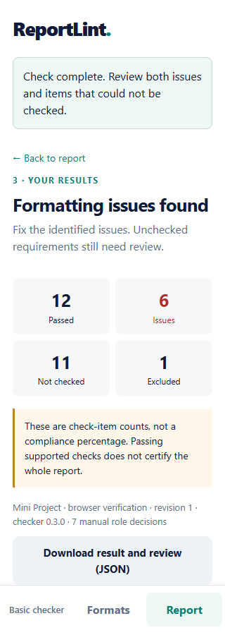

# Complex format workflow on mobile web

The current v2 engine now has a browser interface at **`/app/complex.html`**. Start the server using the main README and open `http://127.0.0.1:8000/app/complex.html`. The basic checker also links to this workflow. No Node.js, frontend build, or additional runtime dependency is needed to use it.

For a phone, use the server's LAN address as described in the README. The native Android app still uses v1 and has not received these screens. This is a responsive mobile web interface for the existing limited v2 capabilities, not completion of the entire complex-report roadmap.

## 1. Review a format

Open **Formats → Add a format document**, give it an optional name, and upload a DOCX under 20 MB. The review screen separates written instructions from formatting observed in the file. Expand source evidence to see the original excerpt and its location.

Choose **Approve**, **Reject**, or **Defer** for each formatting proposal, with a reason. Review the other detected instructions as partial, deferred, manual or outside scope. The interface does not approve anything automatically or silently discard unsupported instructions. If values disagree, the competing interpretations are visible and incompatible approvals block publication.

Choose the report/synopsis profile or explicitly decline a chapter profile. For a selected profile, review each title, choose required or optional, and add any alternative titles one per line. **Save review** persists these decisions. **Save and publish** saves the latest edits, checks blockers, then publishes only when allowed.

Published revisions are read-only. Use **Create an editable revision** to fork one, or use the saved-revision selector to inspect history. A stale edit produces a warning and preserves local input; use **Reload saved revision** to reconcile it. Opening another revision with unsaved edits asks before discarding them.

## 2. Select and review a report

Choose **Report**, select an exact published revision, and upload a report. Use **Check report** directly for style-based checks, or **Review paragraphs** for manually formatted reports.

The paragraph screen shows excerpts, suggestions, and controls for unresolved supported paragraphs. Confirm **Body prose**, **Chapter heading** plus its chapter, or **Exclude**, and give a reason. Suggestions remain unselected until you act. The filter can show unresolved paragraphs or all paragraphs, and longer lists load in batches without losing decisions.

Use the original report when an excerpt is shortened or its role is uncertain. Leave uncertain paragraphs unresolved. Existing parser restrictions still apply: this interface cannot force table entries, field results, malformed styles or unsupported containers into trusted roles.

**Check with these decisions** submits the original file plus a review tied to its exact hash and template snapshot. Changing the selected file or template clears the old paragraph review. A server-reported hash mismatch requires another preview. Role choices remain only in the current page; saving a template does not save report-role decisions.

## 3. Read the result

The result separately shows **Passed**, **Issues**, **Not checked**, and **Excluded** item counts. It never displays these as a compliance percentage. A report with zero detected issues can still say **Some requirements remain unchecked**.

Filter findings by state. Expand expected/actual values and source evidence. Report paragraph, run and section numbers are shown starting at 1 for people; the downloaded API data retains zero-based indices. These are document locations, not rendered page numbers.

**Download result and review (JSON)** includes the findings, source/revision hashes, checker version, and submitted role decisions. Keep that export if you need a record: reports, role previews and results are not saved by the server. Template excerpts and template review history are saved in the existing SQLite store.

The browser holds active report data in memory. It does not put it in local storage or the service-worker cache. The service worker caches app assets only. Reloading the page loses report/role input; the server is required for review and checking even if the app shell opens offline.

## Verification

The end-to-end Chromium test uses an isolated server database and fictional DOCX inputs. It verifies:

- Upload, partial draft save, source-backed decisions, missing-review blockers and contradictory approvals.
- Concurrent-edit conflict handling, explicit reload, immutable publication, fork and old-revision selection.
- Unstyled-report preview, suggestions remaining unapproved, role assignments, retained choices after filtering, and detection of a wrong-size body run.
- Result filtering, JSON export with the same review hash, and honest incomplete-result wording when no supported violation is found.
- Network failures, changed-file review reset, reload behavior, keyboard access to the first form control, no unhandled page errors, and no private report/API cache entries.
- No horizontal overflow at 320, 390, 768 and 1280 px widths, with reduced motion enabled. Screenshots were inspected on mobile and desktop.

The error fixture produced **12 passed, 6 failed, 11 not checked and 1 excluded** items. The partial fixture produced **5 passed, 0 failed and 18 not checked** items. These are scenario-specific item counts, not engine accuracy measurements. Chromium 149.0.7827.55 was used locally. The backend suite passed **167 tests**, with four optional LibreOffice tests skipped. This is not a full accessibility audit, physical-device test, or cross-browser certification.

Visual review found readable cards, wrapping titles, accessible native labels, and a two-column count layout at 320 px. The live paragraph decision count was corrected to update immediately; publication blockers now identify the competing approved values. These changes were verified in the final browser run.



## Repeat the browser test

The browser tooling below is optional development tooling. Python dependencies are already in `requirements.txt`; Playwright is not required to run ReportLint. Use a fresh, isolated storage directory because this test creates template revisions.

```powershell
python -m scripts.create_web_qa_fixtures storage/web-qa/fixtures
$env:REPORTLINT_STORAGE_DIR = 'storage/web-qa/server'
python -m uvicorn app.main:app --host 127.0.0.1 --port 8768
```

In a second terminal at the repository root, with Node.js installed:

```powershell
npm install --prefix storage/web-qa/tools playwright
node storage/web-qa/tools/node_modules/playwright/cli.js install chromium
$env:NODE_PATH = (Resolve-Path storage/web-qa/tools/node_modules).Path
node scripts/verify_complex_web.cjs http://127.0.0.1:8768 storage/web-qa/fixtures storage/web-qa/screenshots
```

On macOS/Linux use `export REPORTLINT_STORAGE_DIR=storage/web-qa/server` and `export NODE_PATH="$PWD/storage/web-qa/tools/node_modules"` in place of the PowerShell environment assignments. Other commands are the same. An existing compatible Chromium executable can be selected with `REPORTLINT_BROWSER_PATH`; otherwise Playwright uses its installed browser. The script produces screenshots, a result JSON, and a browser verification report. All generated files in these commands stay under Git-ignored `storage/`.

## Remaining boundaries

The workflow is synchronous. Durable jobs, cancellation/restart recovery, native Android v2 screens, report-role persistence, rendered page overlays, full semantic interpretation, and the advanced formatting validators remain pending. The UI exposes current supported checks and their limitations; it does not expand the engine's checking capabilities.
